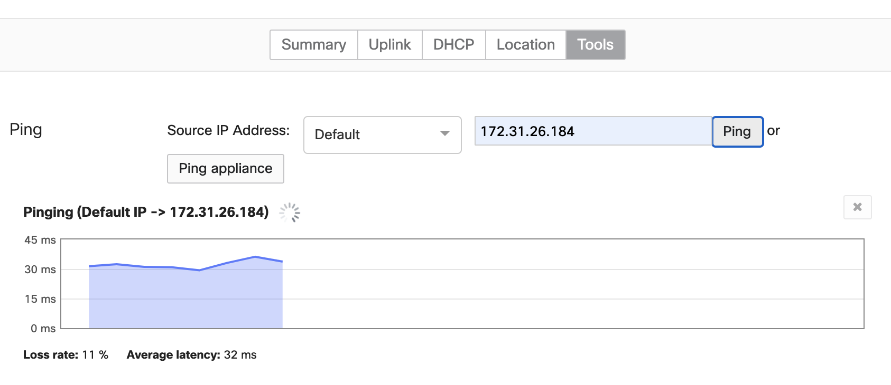

# Overview

This example shows how we can achieve cloud provisioning, service orchestration, configuration management <<enter others here>> using Ansible. We shall:

* Install Ansible and associated libraries and modules
* Run an Ansible Playbook that shall create an IPSec tunnel between
* Meraki MX
* AWS Virtual Gateway

# Dependencies
## Python
This script was develeoped using python version 3.7.3
# Prerequisites
AWS account, running an EC2 instance. You’ll need some details of the AWS set up:
* Aws_access_key_id
* Aws_secret_access_key
* IP Address of your EC2 instance
* Subnet ID of the subnet your EC2 instance resides in
Meraki Dashboard, with an MX Security and SD-WAN appliance. You’ll need the following details:
*	Meraki Dashboard API key

## Installation

### Create a Virtual Environment:
    $virtualenv venv

### Activate the virtual Environment:
    $source venv/bin/activate

### Clone the Repo:
    $git clone https://github.com/andersm9/Meraki_Ansible.git
    $cd Meraki_Ansible

### Install the requirements:
    $pip3 install -r requirements.txt

# Install Ansible:

Details on installing Ansible can be found here:
https://docs.ansible.com/ansible/latest/installation_guide/intro_installation.html#control-node-requirements

For Mac, the process for installing Ansible inside a Virtual Environment is:

python -m virtualenv ansible  # Create a virtualenv if one does not already exist

$ source ansible/bin/activate   # Activate the virtual environment

$ pip install ansible

# Create a file "credentials.yml":

We’re going to store our variables and credentials in an encrypted local file – the Ansible Vault.
We’re going to add the following credentials and variables to our encrypted vault for use by the playbook:

* Aws_access_key_id
* Aws_secret_access_key
* Meraki API key
* AWS Subnet ID
* IPSec Preshared Key

### Create the encrypted file using:
    ansible-vault create ansible_vars.yml

You’ll be prompted to provide a password for this file, and then to populate it with your default text editor.

If you want to later edit the file, use the following:

    ansible-vault edit /path/to/file/ansible_vars.yml

The location of the vault is defined in our playbook under “var_files:”

  vars_files:
    - /Users/mark.anderson/documents/internal/api/keys/aws_keys.yml

Your file should look something like this:

 aws_access_key_id: abc123abc123abc123abc123
 aws_secret_access_key: abc123abc123abc123abc123
 merakiapikey: abc123abc123abc123abc123 abc123abc123abc123abc1237
 psk: abc123abc123abc123abc123T abc123abc123abc123abc123
 rtid: rtb-abc123

The variables stored in the vault can then be accessed as follows, for instance:

X-Cisco-Meraki-API-Key: "{{merakiapikey}}"

Further details around Ansible Vault can be found here:
https://docs.ansible.com/ansible/latest/user_guide/vault.html

## Launch the playbook:

    $ansible-playbook AWS_vMX_v4.yml --ask-vault-pass
    
## Manually test the connection:
A quick ping test should confirm that the MX is now able to reach the EC2 instance. The first few pings may fail while the IPSec tunnel is set up:
## Ping Example

